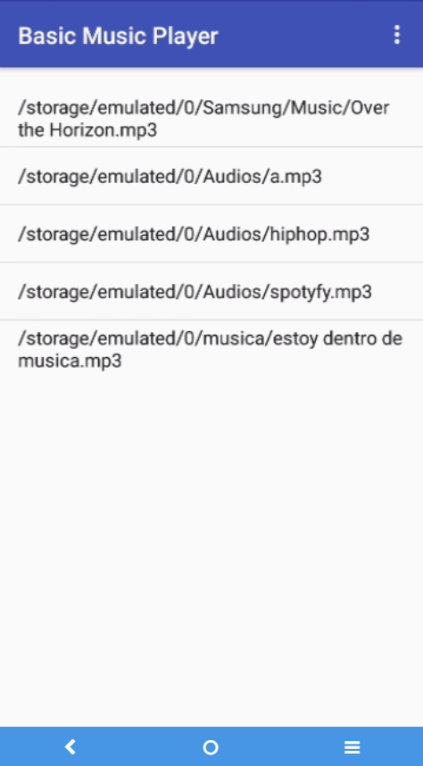
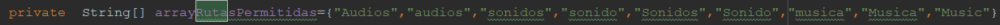

# Basic Music Player documentation / Documentación 

Este proyecto es tan solo para ver el funcionamiento de la clase MediaPlayer de android (Descripción general de MediaPlayer)[https://developer.android.com/guide/topics/media/mediaplayer?hl=es-419]
Sin implementar como servicio.
Para que funcione tendrás que crear una carpeta llamada  o Audios o Musica o Sonidos en la raiz de teléfono y dentro poner tus archivos mp3:

<!--  -->

# Requirements / Requisitos
## Del programa

La música o audios deberá de ser alojada en la memoria interna del móvil y en una de estas carpteas:

## Del móvil

Mínimo Android 4.0 Ice cream sandwich API 15 (octubre de 2011).
Máximo Android Android 10 Q API 28 (agosto 2018).

## Del sistema operativo

### optopenjdk 8 o Java 8 < java 8 u202

A partir de la versión java 8 u202 y java 11, así que o instalas una versión anterior que no te aconsejo a java 8 u202 o instalas [adopopenjdk](https://adoptopenjdk.net/), si estás en windows simplemente instala el programa.

Starting with the java 8 u202 and java 11 version, so either install an earlier version that I do not recommend to java 8 u202 or install [adopopenjdk] (https://adoptopenjdk.net/), if you are on windows simply install the Program.

> Marca la ocpión de establecerla variable JAVA_HOME.

> Check the option to set the JAVA_HOME variable.

### Android studio + SDK android

[Download android studio](https://developer.android.com/studio?hl=es-419)

Another alternative is / Otra alternativa es [IntelliJ IDEA comunity](https://www.jetbrains.com/es-es/idea/download/#section=windows)

# How to open the project / Como abrir el proyecto

El proyecto debe ser abierto pinchando con el botón derecho del ratón en build.gradle (que se encuentra en la raiz del proyecto) y elige tu IDE.

The project can be opened by right-clicking build.gradle (located at the root of the project) and choosing your IDE.

# information / Información

Los proyectos android studio llevan integrados gradle, este proyecto descargará gradle-4.10.1-all automáticamente, descargará las dependencias y configurará su entorno de trabajo, gradle también utiliza tareas, como la de compilar, ejecutar, etc, tan solo tiene que pulsar el botón de compiladción.

The android studio projects have gradle integrated, this project will download gradle-4.10.1-all automatically, it will download the dependencies and configure your work environment, gradle also uses tasks, such as compiling, executing, etc., just press the compilation button.
